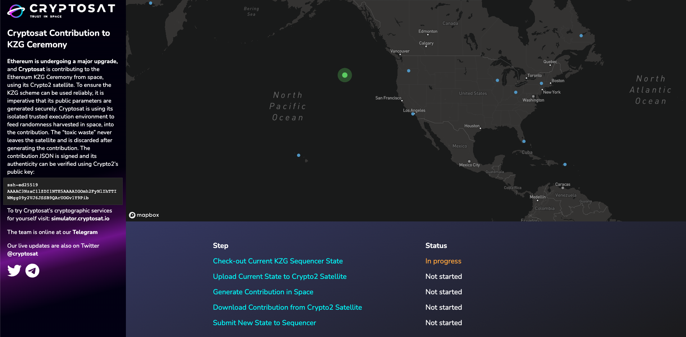
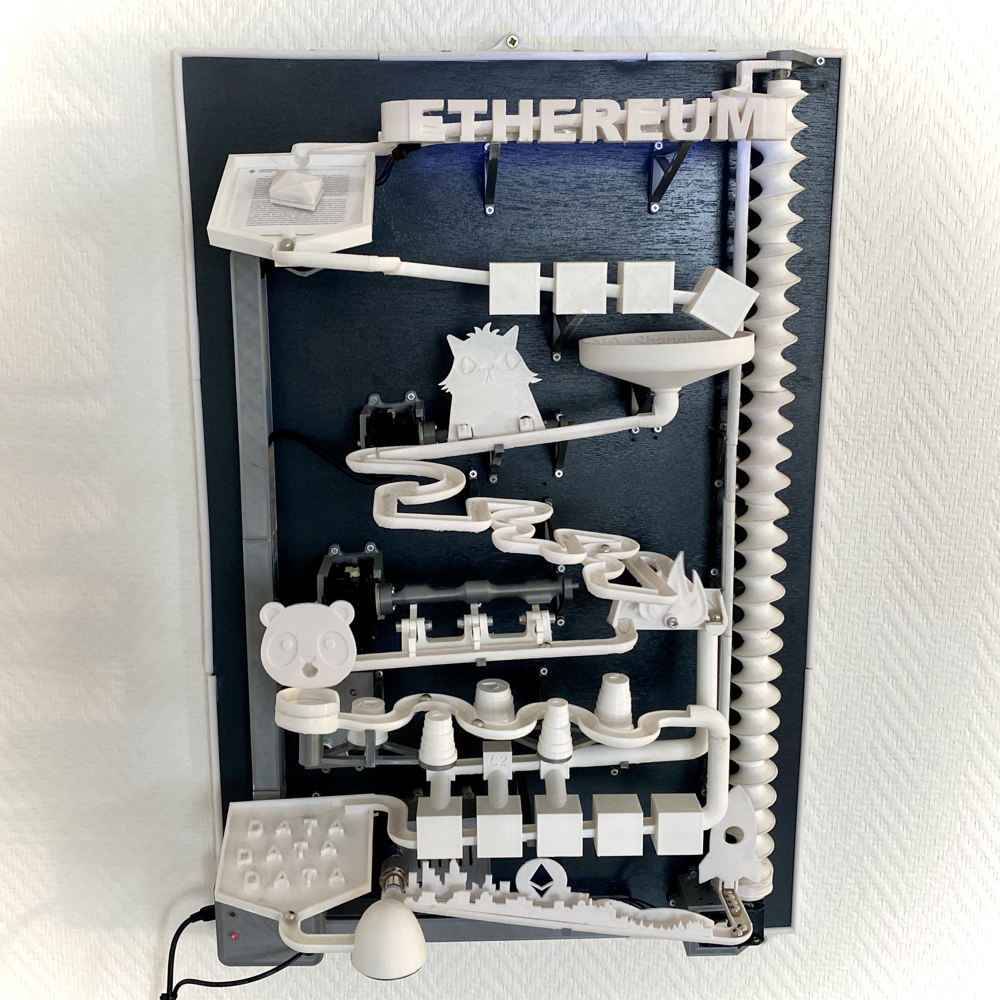
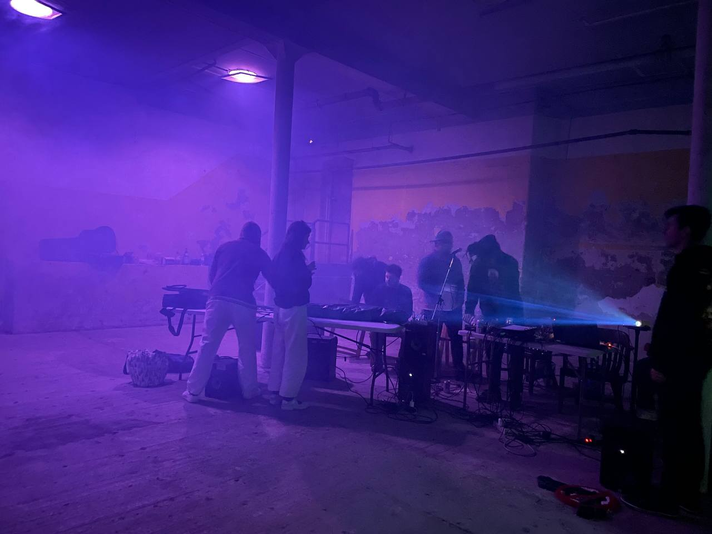
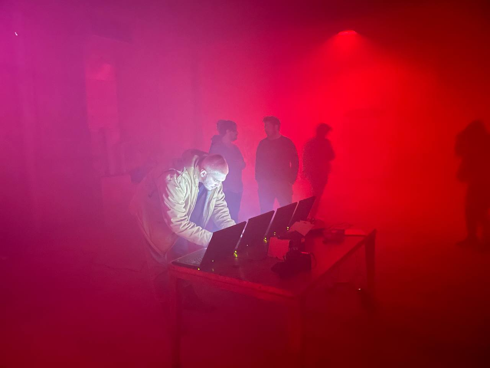
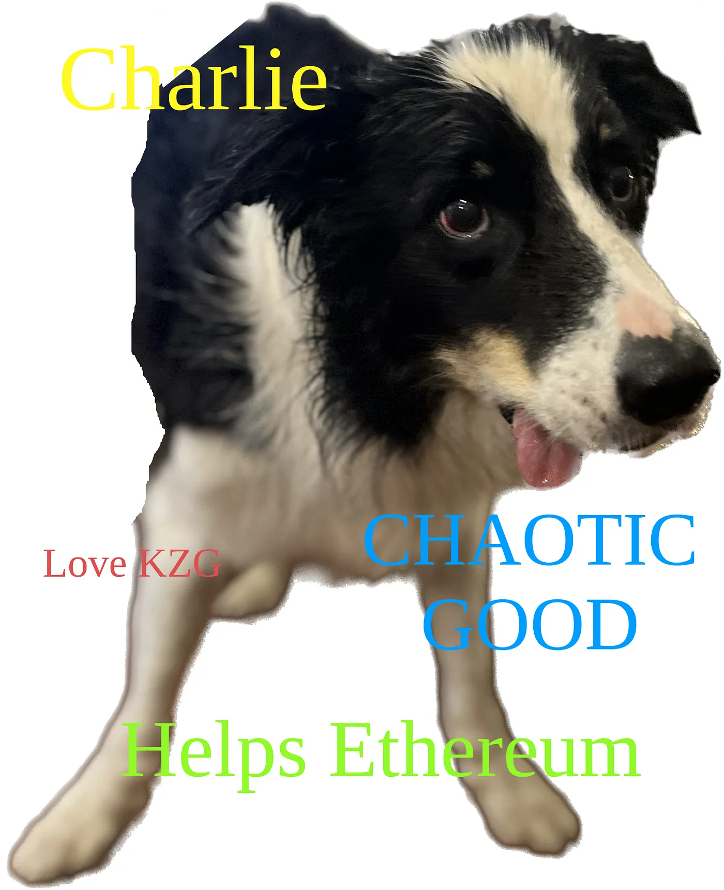
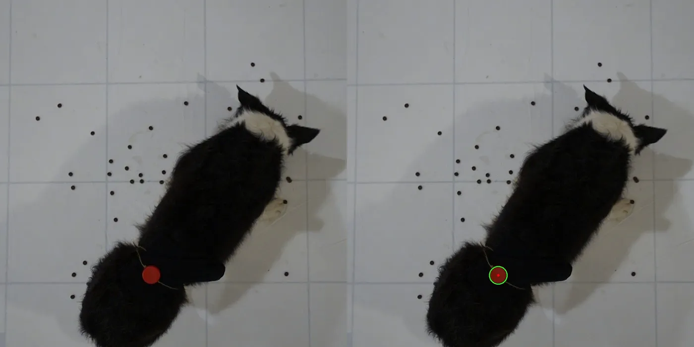

# KZG Ceremony Special Contributions

## Cryptosat

The Cryptosat team kicked off the Special Contribution period with a contribution from space aboard their Crypto 2 satellite. Read about what they did and how on [their blog](http://web.archive.org/web/20230415055203/https://docs.cryptosat.io/cryptosat/cryptosat/contribution-to-the-ethereum-kzg-ceremony).

__Ethereum Address:__ `0x15be596f2245ab321d8a357f827006520330a98c`

__Powers of Tau Pubkeys:__

```text
2^12: 0xb421fda424006dd5a8ab53874570fd39abda0fcf9dc6cda98864435b00e0e6c050bccf78c08e0b911b3bb28572bded470beb7be25005316280ca624315855e2f281f80296f6f9df229b37f9d65ed4db364659f9c952ba6c3340d4d87990f9945
2^13: 0xa75ab853ccb44441209ff9dda2750c9a2e20057556242512bc4e10eba51314f30136bdea955e076ea45042e723bc0dc917ec9b81ba358239df68d66750d3e19b16760c3eff1831847f6d081c5152b8bcd7eaf129250b7b5f0fbd39b7077b3ac4
2^14: 0xa596762cb98d5f8e3df3f2caa15270f1e97cb138c75dc7316371884b33756c68e2e78cfe6821a032dced340aab9a861f09de5018b7c02ee6e5fb5e1bfc9cbcb865eb3fbedaeb0d9020a11137436b1c3a50749f54e9a4c33028d1153a3d4ef4e1
2^15: 0x86a6823f45d6fdc7968494b69ba099194509f702e380c3730b98cf81a08a7853e0e90c22e9073543b03854bf91e3d96d1718d373dee465ceccd6075bfa53fa740b7cbfd422adf765a5b970b41a069d8fb2394f6d09ab6c82404913586ab77192
```



__Tweet by contributor:__ https://twitter.com/cryptosat/status/1643651104889241600

__Additional Links:__

- [Bloomberg article](https://web.archive.org/web/20230424063128/https://www.bloomberg.com/press-releases/2023-04-04/cryptosat-prepares-first-ethereum-kzg-share-to-emanate-from-an-earth-orbiting-satellite)
- [CoinTelegraph article](http://web.archive.org/web/20230415075050/https://cointelegraph.com/news/satellite-orbiting-earth-participates-in-the-ethereum-kzg-ceremony)
- [Yahoo Finance article](http://web.archive.org/web/20230405213314/https://finance.yahoo.com/news/cryptosat-prepares-first-ethereum-kzg-151500931.html)
- [Nasdaq article](http://web.archive.org/web/20230406105333/https://www.nasdaq.com/articles/cryptosat-joins-the-ethereum-kzg-cryptography-ceremony-from-space)
- [Crypto News Flash article](http://web.archive.org/web/20230404153101/https://www.crypto-news-flash.com/cryptosat-ethereum-kzg-ceremony-receives-participation-from-an-earth-orbiting-satellite/)
- [TipRanks article](http://web.archive.org/web/20230405213313/https://www.tipranks.com/news/article/cryptosat-joins-ethereum-kzg-cryptography-ceremony-from-space)
- [Benzinga article](http://web.archive.org/web/20230424063640/https://www.benzinga.com/pressreleases/23/04/31659948/cryptosat-prepares-first-ethereum-kzg-share-to-emanate-from-an-earth-orbiting-satellite)

## The KZG Marble Machine

The KZG Marble Machine is an artwork\contraption with different sections of track showing off different phases of Ethereum's history. The machine uses 23 sensors to measure small fluctuations in each marble's run as well as various environmental factors to ensure the randomness is unbiased. Read [`xofee.eth`'s writeup here](http://web.archive.org/web/20230415205327/https://medium.com/@Xofee3/the-kzg-marble-machine-my-special-contribution-to-ethereums-kzg-ceremony-d137313443a1) or even [3D print your own machine](github.com/XofEE/KZG-Marble-machine).

__Ethereum Address:__ `0xFF141bFc450c57Ad84eBaFbD09ffa94A268a7aaE` (`xofee.eth`)

__Powers of Tau Pubkeys:__

```text
2^12: 0x8474cca7c0ad72f912ee6ea901becc3893de4bce965278befca5b06a2e4ad308ed9d7f9543598f69707e16af81c47de60f1ac5286fb2bc4bf6c9cb868c3f2ce9531241c77325a03cce8f7a2731931cefeb179070ba75336be918313d85261ad7
2^13: 0x859aedfa6f8070522fdd0df84b6233671a6221e611914e198a81a78684d3b0deb0a6d4248f0562b2f3e01ee342e731220b595db2758907c8d1d353f4e8c606ccbefc62efbf13e4a2fed8001c308db198c121b9dfda700756f466dba39c3936d5
2^14: 0xa1fbe4bbee1321f97f4ebbbd98632c84ca61623adf1d476a39a2f90929116e82dca4cb53d18ad319c7d561f1623ac5e903b83360923e3c1b23c0bbfd0d472691a7f9c273f62bedf16daab0320d3bffbc33b55814c05e5b7e804ec8b6700b0b6b
2^15: 0xb543a678fa7ce903883ed00aa2b344a0c34e9539a216bf2f36ba25e08f06037291e5a08923c8ab19aafc75891c8633fd0b431806039dd815aeb1eb59c382cba75db5563ebbcd51f317f78369d0ebe639d80850b621938a56bfe5a7a1dc149f48
```



__Tweet by contributor:__ https://twitter.com/Xofee3/status/1644016160210313218

__Additional Links:__

- [Marble Machine Youtube Video](http://youtu.be/zKrcUxOeBF4)

## Mr. Moloch's Ephemeral Album II

`smartcontracts.eth` brought 40 members of the New York Ethereum community together to make an album together over the course of a day. The result was a an ephemeral album: attendees got to listen to the music while it was recorded by 3 second-hand computers which then used these recordings as entropy to contribute to the ceremony before they were destroyed.

__Ethereum Address:__ `0x4cdc4f412355f296c2cf261210cc9274404e442b`, `0x68108902de3a5031197a6eb3b74b3b033e8e8e4d`, `0x3a953298098cadcb621a40c1efcfb7dd73b727af`

__Powers of Tau Pubkeys:__

```text
2^12: 0xa7759b45d54e451b9e1b8c75f6989ddedc5883faf758cf24c164f28f18a9c28a3bf5cc9c6d373be2179ee3799e84226c0844e387756997ef9f17b3a31aefc128a58b387cdd5f9769c7a44cc617473c649fd6898e76c1fe6a9dbfc9c558f2830a
2^13: 0x8253d83311bbf25608cef844f7fb1fb242199989f2b570ae8e47012e4de4a6411e0ff124d408c6e36665d2537ba8015a071b27292decff76b24ab9ed1801fb9417b09610a8f5493023cc0369a4928e4b0c245f72b9a25dbabc746c1e41332c3e
2^14: 0x8bbb410a8343e7b58074c5c565128aa56770d24dead438d91b21eb8d6c96d386f7c848f11449c9b65c41889a17ec703006bd98feac3b1f4c1bb3306c9442bf6d00e486afd8b921bc13a372806c2120271d037725dfa30c215ef3ed5ba3db4a98
2^15: 0x824ad6476d49e2a5e450298f7a5d772e435f221e71b5064b2f00f1bd10df2fa8b5c07cdbd5a25491dbbd87b01c7fbdb60264ecbe46700cfdd85582b2be250919bc080ef70f56c81093dc5871a4fc291a9f152839dd309d4d641c3a70a50554fb
```
```text
2^12: 0x85589d23b34e05459dffe32c0056d38c5169febc9057d2b27b6035dcff2d0c22bfb4fa5c35320a60a5be90f74c8854a00f9a7fab86abd4ac7f7e9fa4596a81eb9cf0a52b996e590ce0405d66b64b77e3b647eb442afff7ce458b140da71ac3f5
2^13: 0xa6f7823adc830bf825d27787086172969a5240ec8cd5b961fdd96974cba1b1f8a16765b618fabf23d22ad9c6c418f32711f208091a210a632ee0bb321dad0dc5e1cd69dd75116a0ac82bd48e75070501ead7548ec13f37030df293e7ee285c89
2^14: 0xb0eeccf05f44ff300239d08ae4d560174b56940cd7883d2df0b5af37169bf5efa459d70bed7f6ea78ce358eaa33834c314e18d5435cdc119f18058223bbe0d3b6e54fdc82d3f1f13acb31f62153683b44c71654a46fa240ab442e5dc41eeb8ab
2^15: 0xb5897c2bc22f85b1b058e128782946cc1542ff335056bd4c5862f1c01fa54955ff521840fcc4798fbf02c0550b3faba91359a221b1290583a69f8ce45573655d11d8c16d5ca23fa1b97dc9502247eccc85b27ac2f02ee6d76024dd17c76c3d71
```
```text
2^12: 0xa5b8ebc3d76ee03334da93a3fbc63a4378269d02531c1b29b22b63795e25db7a0f46693be4624b2c1d157f651c3226fe00b6d6c2011589f68badb272e52268fe0522da249e28b9beb325bc19fd0840c4cee4859b9c0ebe0791ae74444c725552
2^13: 0x8cb45dedabb4a944d3d53f842e2ed7214fcaf10c4138119e72f0a400d9c2615c8621e83f2d00f16cef5beca4c54422ce06524f9eea82bb7cc3d7a5f750b8761d4667c84556ecc9c1670f8013d4bad903131d714c9373ff4549c991aaa26aad3d
2^14: 0xb789d13d48b2969c493f11bb9b6612506273cf092abf9a104875af070d6f3797fbe8ed0f9f370b6d7c4b8fe753b6ed3501bdf76aa835bd2e05f4345cf8c5f14d99949d43be8e94b6986cf13576efc3d56de54f5ebbed5112990c6a9b1cf2cf1e
2^15: 0x80a7166c5804c2b0c621125605d4e9ed11a997b96d5e4ee0c3118271d4307e02aa50d08ef159da25388393c492331aeb0d9dbae554f7a84eb6fd9beaf97ef1989fb5f0231b1cfc5d4021ac730b7408725126a1a92e030fbfe8cb0c5333741239
```




__Tweet by contributor:__ https://twitter.com/trent_vanepps/status/1645532615137693703

## Dog Dinner Dance Dynamics

@saint-rat fed their dog, Charlie, biscuits which they had scatted over the floor. They then used [a python script](https://github.com/saint-rat/KZG-Ceremony-Contribution-Code) and computer vision to track the location of Charlie and the biscuits as he ate them. This information was folded into the entropy contribution before destroying the SD card and flash-drive used by the Raspberry Pi for the contribution. [Read the details here.](http://web.archive.org/web/20230416141630/https://medium.com/@saint-rat/dog-dinner-dance-dynamics-a-peculiar-path-to-enhancing-entropy-in-the-kzg-ceremony-86a0b2a4eaf0)

__Ethereum Address:__ `0x051f77131b0ea6d149608021e06c7206317782cc`

__Powers of Tau Pubkeys:__

```text
2^12: 0x88b8e361e6912a4e9e01ed7adea527f2048278e2df20c21d8bc963ed9bfe2be59d6e6d0634656a924096b3da252a24b310c821c97613ff3fcfbf81eb37331c0d1f35d1fc68a40b9f2914f794b777829783e72539f47234b606291237974045e6
2^13: 0x89683cb512dca33e41e19b71354e461fe3f9c02985a64f5d6475d6b2b3d8bc923e35b4f465f99d23f03e7398157c111c0f0412868cd8a2dd33f55728e73cea2abb5f32c5cc13ae6d3f9b455ab8f4ace09d251476054722c2d373d2033b5d7fcd
2^14: 0xb228e137e41e89c07e6ca0d74bcb38a48a3f56de222e7b643d5e2d796a0f095d009bef7832c513be7e0422c5ce9b1c2603fd2614e6b9778387606c45c11083dd410cfb3e0dbef4f0461b3c72b6702577d1dbda4c2f64c71b288ea79157fd8e9d
2^15: 0x8e1cb174735fdb0c08218ac53ac91b02e3b3e58eb4c2fa860d08958c93b3e9b58f91a46eef5a594e709472d5e3eadf3c0d601086e4b5ed73ef2d0fc3c745e0ba716661f1bc1ed4570b12fbe49d66c950c9e9e4e97641a5f819b3c99397461f19
```




__Tweet by contributor:__ https://twitter.com/saint_rat/status/1647598125480284161

__Additional Links:__

- [Video of hardware destruction](https://twitter.com/i/status/1647601259724275713)

## `CZG-Keremony` - a pure JS KZG ceremony client

[`CZG-Keremony` is a KZG ceremony client](https://github.com/dsrvlabs/czg-keremony) written entirely in JavaScript by the [DSRV Labs](https://www.dsrvlabs.com/) team. Under the hood, it uses @paulmillr's [https://github.com/paulmillr/noble-curves](noble-curves BLS implementation), so this is an end-to-end contribution done in pure JS. `rootwarp.eth` and @kim201212 performed an airgapped contribution on a RaspberryPi 2 before destroying the SD card.

__Ethereum Address:__ `0xa455150c6b91d08faa57dc664b916e1ddd1c4030`

__Powers of Tau Pubkeys:__

```text
2^12: 0xaf4de210b2cf4dd36cad375b215748cf226fbb1c6bc700c563881bd5cf5e6fd74b092f8bf32e3dffe3dfbec16032d88c0058184951521a32b02a5fd9c3cde14f2f78d2149b2e7e9d175c70408f2e89e0af9e4cc5b2712754e6185423b381b3b1
2^13: 0xb45ecbf063b0c558a726c18e9aba1b87a71cbc0553f696f8de1fd2c6eed741808ff17a9b6578b01d8eabb85ba70f7392101133305b11f8ae6b160da6e3c8ddc7c58b853e142ede847bb2c1fc61b4289ac251508af5d0b464f739f5192fc1e44a
2^14: 0xaba601aa8a77c671835670f1c2d402ea804b85b74f3be6cf186680515155ba4558d9d169bea9238eb1d5f4ffb3276d2415f5014175aec71e9a4c52fc716090734bb22ee1e7c8f425cc0e5d4996110f882e7f46cb12029cc93db72db317849a70
2^15: 0xb4f7516dbab3beccb7ddc2ec8852dc0c131e89b59becbec89d9e30ba6a121e7002e17da431924b5a21d47d215ac73a5e0e8bf8604909d9cde9115abd4ee1d859186461d8c53511cfc7114e1118fe899ab82dc4022adc41e70a08f07abffe2591
```


__Tweet by contributor:__ https://twitter.com/rootwarp/status/1646717380868083712


## `srsly` - an iOS KZG Ceremony client

`srsly` is a KZG Ceremony client (and BLS library!) for iOS written in Swift by @srikrishnamurthy. The library is available on GitHub [vishady721/swift-kzg-ios-client](https://github.com/vishady721/swift-kzg-ios-client).

